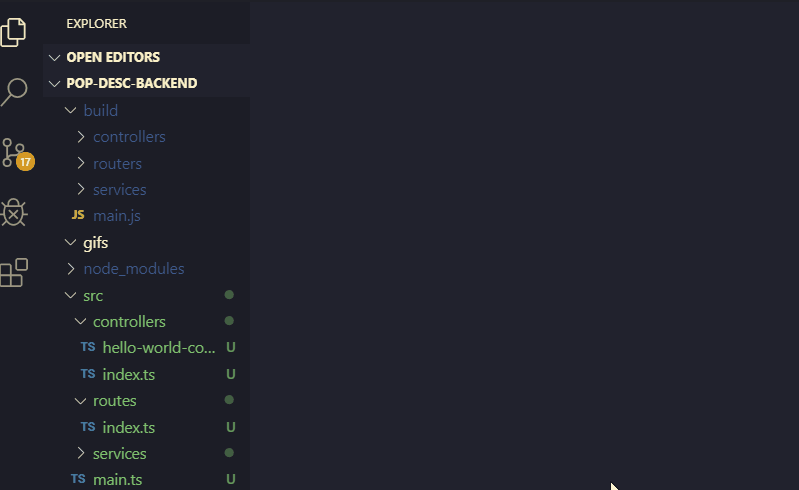
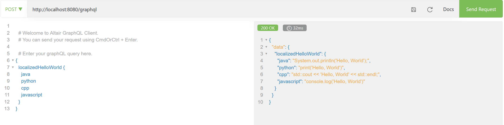
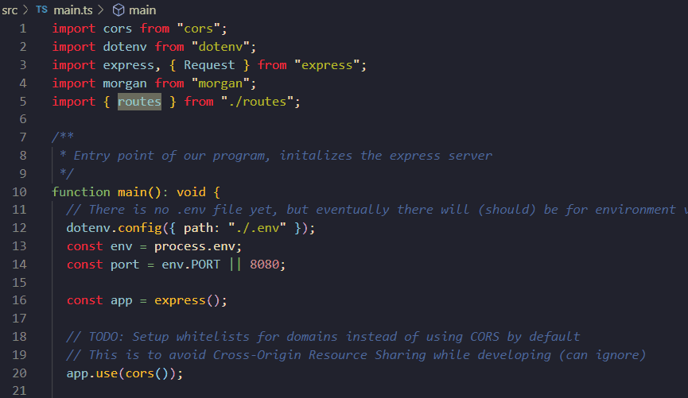

# Smart Contract Service

The purpose of this repository is to demonstrate how to use smart contracts and any tools in the etherium development environment to successfully demo a working implementation of a smart contract. The smart contract created is a simple implementation of a storage for user's looking to store personal descriptors (weight, height, or any other units they want).

## Prepare your editor

The editor of choice is [VSCode](https://code.visualstudio.com/) for its extensive support for JavaScript and TypeScript development. it is **strongly** suggested that you use it. Two **MUST HAVE** extensions for VSCode is TSLint (deprecated) and Prettier. TSLint catches errors and enforces policies for TypeScript code, and Prettier formats your code when you save to a standard format. Configurations for TSLint can be found at [tslint.json](tslint). Please ensure you are downloading the deprecated version of TSLint as that has Autosave functionality.



## Install

Ensure that you have the latest [Node.js](https://nodejs.org/en/) installed.

Download [ganache](https://www.trufflesuite.com/ganache) GUI. This is a local blockchain that you can run on your own computer for development/tests. There is a command line version that we use as well but this can be a lot easier to visualize.

Sometimes the compilation of some libraries can fail if you don't have a c/c++ compiler installed since the Solidity compiler needs it. For linux systems, ensure gcc/g++ is installed; for Windows install [VS2019](https://visualstudio.microsoft.com/vs/) and ensure that you download the C++ windows toolchains.

Install all needed libraries with the following npm (Node Package Manager) command:

```
npm install         # This will install all dependencies listed in package.json in ./node_modules
```

To generate the final **GraphQL Schema**, compile **Smart Contracts**, generate types for TypeScript from the Smart Contracts(to make development easier), and finally compiling TypeScript down to JavaScript, run the following:

```
npm run build       # This should run automatically after npm install for the first time
```

## Query the GraphQL API!

The GraphQL API endpoint is the following

```
http://localhost:8080/graphql     #POST Request Only!
```

You can query the API after starting the server with

```
npm start
```

by using a [Altair GraphQL frontend client](https://altair.sirmuel.design/) (available in Chrome/Firefox/etc).

It looks something like this:


## Get familiar with the repository

All important scripts are documented to help understanding, granted there may be typos everywhere. Try to read the purpose of a particular file, class, or function and then try to read the code. This can be a daunting part and will not be done in the space of a few minutes. The directory structure is below for pointers on where to go.

(\*\*) - Don't need to pay attention to or modify. Should look at everything else.

```
.
├── README.md
├── bin         # Convenience scripts
│   └── deploy-contracts.ts         # Script to deploy all Smart Contracts to local blockchain
├── contracts           # Contains all smart contracts
│   ├── Migrations.sol          # This contract is created and needed by Truffle (**)
│   └── UserDescriptors.sol         # This contract is newly made
├── gifs        # Contains cat gifs, ignore
│   └── tslint.gif
├── migrations      # Deployment scripts needed by Truffle (to add new ones, prefix it with another consecutive number)
│   ├── 1_initial_migration.ts      # Created and needed by Truffle (**)
│   └── 2_user_desc_migration.ts
├── package-lock.json       # Do not ever modify manually
├── package.json        # Contains all dependencies and scripts needed for this project
├── src         # MAIN source directory for the main program; currently it just invokes and demos the smart contract
│   ├── index.ts        # Entry point of the main program (open and read)
│   └── services
│       └── user-descriptor-service.ts      # Abstraction/Wrapper for UserDescriptors smart contract (open and read)
├── test        # Contains all tests
│   └── userDescriptors.ts      # Currently tests all operation of the smart contract in the blockchain
├── truffle-config.js       # Configuration file for truffle (**)
├── tsconfig.json       # Configuration file for the TypeScript compiler (**)
├── tslint.json     # Configuration file for TSLint (**)
```

To get familiar with the repository and how we can use Smart Contracts, first look at the [UserDescriptors](./contracts/UserDescriptors.sol) smart contract which was made to record descriptors for a particular user. After understanding what the contract does, look at some code that uses it from the JavaScript (TypeScript) perspective. The code for this is in the [src](./src) directory. The entry point of the program is in [index.ts](./src/index.ts) which uses a custom class in the same subdirectory to invoke the contract's methods in the blockchain.

To navigate through code between files and functions, just CTRL-Click on the variable/class/function of interest like so:



## Contributing

When you first pull this repository, your current branch will be "master"; master is blocked from pushing to protect our code. When you want to make a new code change, ensure that you are on the master branch and do the following command:

```
git pull        # Ensures that you have the latest master changes
```

Then create a NEW branch that will contain your change

```
git checkout -b new-branch-name         #Make sure your new branch name is descriptive of the feature you are working on (auth-request if you are working on an authorization request change).
```

Then, after you are done making changes, ensure that you add to verify that your change works in an isolated environment by adding tests to the ./test directory. Finally, do the following to push your code to the branch to the remote repository (github).

```
git add .
git status          #This is optional, just ensure that ONLY THE FILES that you need to push show when you use this command
git commit -m "Added authorization request feature"     #A set of scripts will run just to ensure formatting and testing is done before this commit
git push --set-upstream origin new-branch-name
```

Finally, we want to ensure that the code we are pushing up is good code, and this is best done by peer review. To do this, go to github.com and go to your branch. Then create a new "Pull Request" which essentially means you are requesting to pull this branch into master. Ping someone to review and read your code, if there are things that could be fixed, address them and repush to your branch. Finally, when a reviewer approves your code, you have to merge into master from the github pull request UI.

For anyone new with git that is uncomfortable with the command line, take a look at this: [Sourcetree](https://www.sourcetreeapp.com/). Its perfectly fine to use either as long as you know what you are doing, its also okay to experiment as master is blocked. :D

## Misc.

To use any executable library installed with npm, you have to use npx (Node Package Executor). For example, the following will fail (if you didn't install it globally ofcourse)

```

truffle compile         # This will only work if you install it globally (npm install --global truffle)

```

Instead, use npx to execute it

```
npx truffle compile

```

You can see all the available scripts that are available (and you can change) in the [package.json](./package.json) file. Some scripts were made in the context of a bash shell (Linux) so it may not work with cmdline or powershell. If you are using Windows, I suggest using [WSL](https://docs.microsoft.com/en-us/windows/wsl/install-win10) to use Linux in an Windows environment.

```
"scripts": {
    "start": "ts-node src/index.ts",        // starts the main program

    "build": "tsc -p tsconfig.json && npm run build:truffle && npm run generate-types",

    "build:typescript": "tsc --p tsconfig.json",

    "build:truffle": "truffle compile",

    "generate-types": "typechain --target truffle './build/**/contracts/*.json' && typechain --target web3-1.0.0 './build/**/contracts/*.json'",        // generates TypeScript types from the Smart Contract to make development easier

    "postinstall": "npm run generate-types",        // runs after 'npm install'

    "migrate": "truffle migrate",       // uses truffle to migrate contracts to blockchain

    "migrate:test": "truffle migrate --network test",       // uses truffle to migrate contracts to a test port (8545)

    "deploy:local": "ganache-cli &",

    "kill:local": "pkill -f '.*ganache-cli'",       //may break on Windows, kills local blockchain

    "test": "npm run deploy:local && truffle test --network test && npm run kill:local"      // The last part may break on windows
}
```

For example, to run the deploy:local script which deploys a local blockchain to port 7545, execute:

```
npm run deploy:local
```

## License

MIT
